# 1701QCA Final project journal: *Caio Bindi*

<!--- As for other assessments, fill out the following journal sections with information relevant to your project. --->

<!--- Markdown reference: https://guides.github.com/features/mastering-markdown/ --->

## Related projects ##
<!--- Find about 6 related projects to the project you choose. A project might be related through  function, technology, materials, fabrication, concept, or code. Don't forget to place an image of the related project in the appropriate folder and insert the filename in the appropriate places below. Copy the markdown block of code below for each project you are showing. --->

## Project working title ##
Mini Hoop Automatic Score Board

## Related projects ##

### Related project 1 ###
Automatic Arduino Goal Counter for Table Football/Soccer

https://www.youtube.com/watch?v=WqkIgd9vjbk

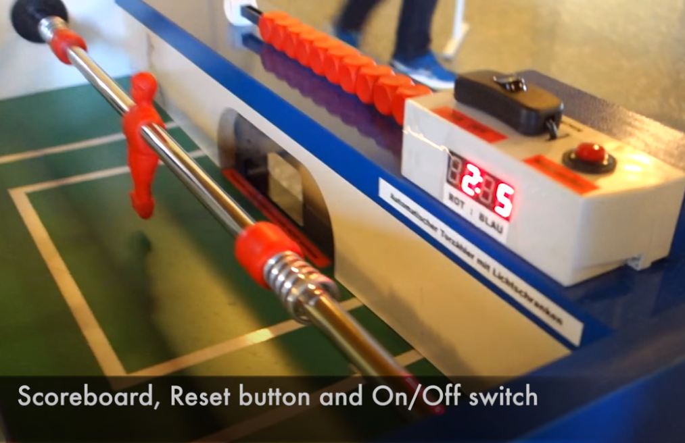

This project is related to mine because it has the same function and concept. They both are used to automatically count a score when playing a game.

### Related project 2 ###
Automatic Basketball Score Board

https://www.sitepoint.com/create-an-automated-scoreboard-that-senses-your-score-with-a-raspberry-pi/

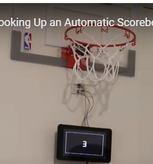

This project is related to mine because it has the same function, concept and technology. They both are used to automatically count a score when playing a game. They also both are using a sensor to detect the ball going through the hoop. 

### Related project 3 ###
Automated Cornhole Scoring System

https://www.youtube.com/watch?v=AZAraY28n6E

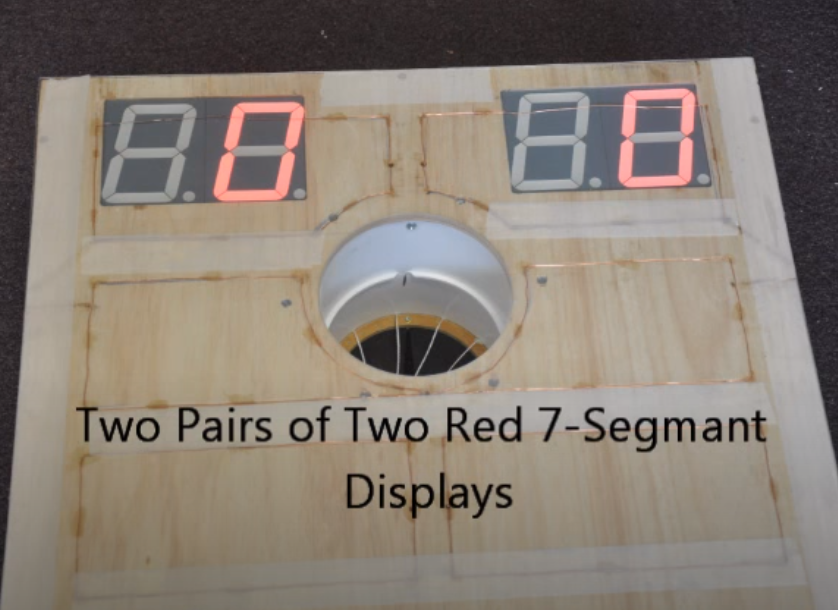

This project is related to mine because it has the same function and concept. They both are used to automatically count a score when playing a game.  

### Related project 4 ###
Smart Basketball Scoreboard

https://create.arduino.cc/projecthub/marceloavilaoliveira/smart-basketball-scoreboard-f922cb

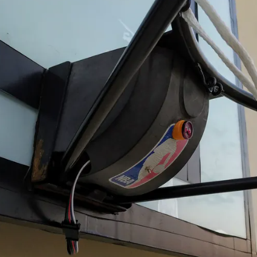

This project is related to mine because it has the same function, concept and technology. They both are used to automatically count a score when playing a game. They also both are using a sensor to detect the ball going through the hoop. This one is more advanced than mine because they are using a smart phone to display the score.

### Related project 5 ###
Touchless Automatic Motion Sensor Trash Can

https://www.hackster.io/will-su/touchless-automatic-motion-sensor-trash-can-bbeed1

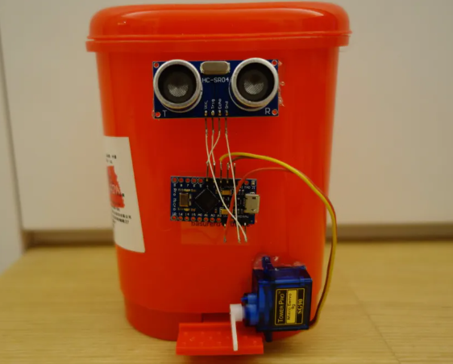

This project is related to mine because it has the same Technology. They both use motion sensors to detect movement.

### Related project 6 ###
Security System

https://www.hackster.io/alpha/security-system-2188de

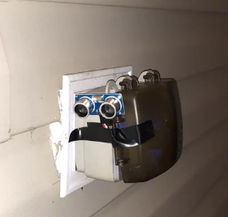

This project is related to mine because it has the same Technology. They both use motion sensors to detect movement.

## Other research ##
<!--- Include here any other relevant research you have done. This might include identifying readings, tutorials, videos, technical documents, or other resources that have been helpful. For each particular source, add a comment or two about why it is relevant or what you have taken from it. You should include a reference or link to each of these resources. --->

### *Brief resource name/description* ###
https://www.safewise.com/resources/motion-sensor-guide/
I first looked a motion sensors but figured it would be too difficult.

https://www.elprocus.com/infrared-ir-sensor-circuit-and-working/
This was a reading about how IR sensors work. It gave me a better understanding of how to use them. It is relevant to my project beacuse I am using an IR sensor.

## Conceptual development ##

### Design intent ###
<!--- Include your design intent here. It should be about a 10 word phrase/sentence. --->

My first design intent was to create a mini basketball hoop game which counts the scores. But I found too many similar projects so I came up with a different idea. Instead of just a basketball hoop I will make it a bin where you can throw paper in and once it is full it will alert you.
 
### Design ideation ###
<!--- Document your ideation process. This will include the design concepts presented for assessment 2. You can copy and paste that information here. --->

### Design concept 1 ###
Basketball Bounce Tracker

The purpose of this this counter is to count the amount of times the ball is bounced. This will be done by using a micro:bit which will be attached to the ball and each time the ball hits the ground the mirco:bit will detect impact and add a number to the LED display.  

### Design concept 2 ###
Interactive Noughts and Crosses

This will be played like normal but will be more modern. Instead of drawing a nought or a cross you either single or double click a button (single click noughts, double tap crosses). When placed an X or O will be displayed on the micro:bit led display. 

### Design concept 3 ###
*This more fully developed concept should include consideration of the interaction scheme, technical functionality, fabrication approach, materials to be used, and aesthetic.*

Mini Basketball Automatic Score Board

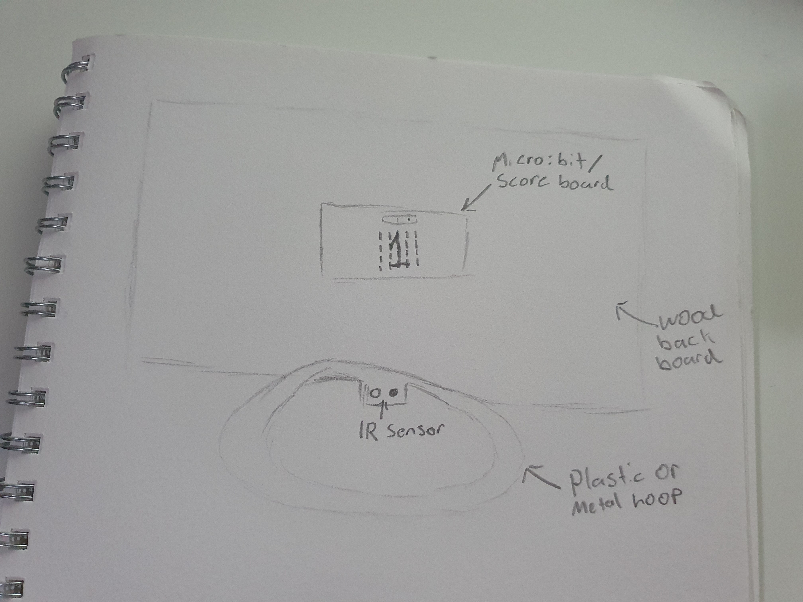

This project will be a game were the aim is to score as money points as possible in under 30 seconds. How this will work is there will be a sensor right under the rim. I am still experimenting one which type of sensors I will use. The two main ones I'm testing is a light sensor and IR sensor. What I am thinking for the 30 second timer is when it runs out, the score will go back to 0 and it will make a noise. If I do chose to use a IR sensor I will have to purchase that and a micro:mate (breakout board). For the hoop itself I am going to construct one out of wood. The experience of the user will connect with the functionally of the project via vison and sound.

### Final design concept ###
<!--- This should be a description of your concept including its context, motivation, or other relevant information you used to decide on this concept. --->

When final design concept was a bin where you can throw paper in and once it is full it will alert you. My motivation behind this was that at first I wanted to just a mini basketball hoop game. I felt like that was too simple to I had to incorporate my own ideas. 

### Interaction flowchart ###
<!--- Include an interaction flowchart of the interaction process in your project. Make sure you think about all the stages of interaction step-by-step. Also make sure that you consider actions a user might take that aren't what you intend in an ideal use case. Insert an image of it below. It might just be a photo of a hand-drawn sketch, not a carefully drawn digital diagram. It just needs to be legible. --->

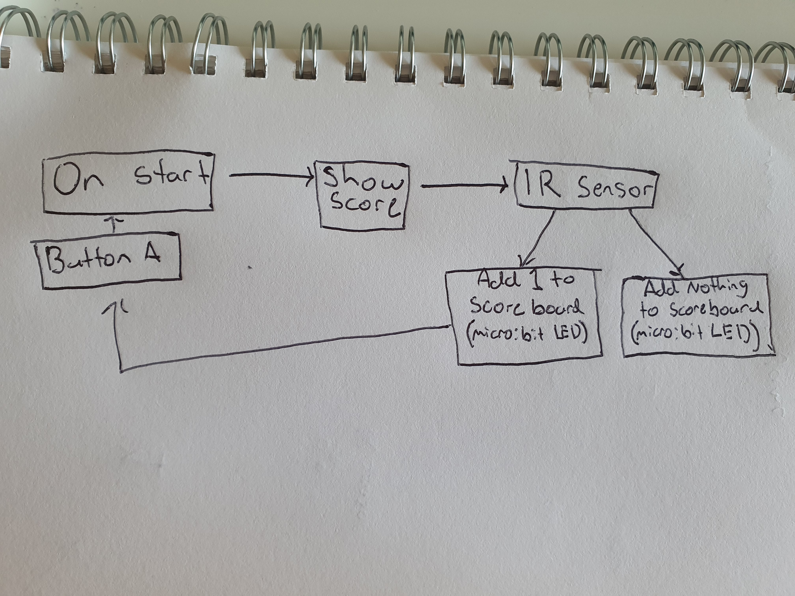

## Process documentation ##
<!--- In this section, include text and images (and potentially links to video) that represent the development of your project including sources you've found (URLs and written references), choices you've made, sketches you've done, iterations completed, materials you've investigated, and code samples. Use the markdown reference for help in formatting the material.

This should have quite a lot of information! It will likely include most of the process documentation from assessment 2 which can be copied and pasted here.

Use subheadings to structure this information. See https://guides.github.com/features/mastering-markdown/ for details of how to insert subheadings.

There will likely by a dozen or so images of the project under construction. The images should help explain why you've made the choices you've made as well as what you have done. --->

## Getting the technology working ##

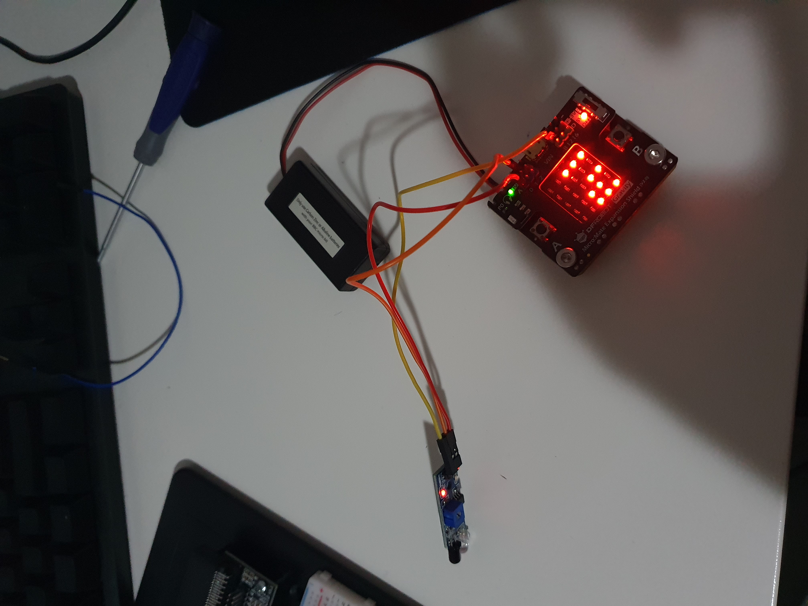

Figuring out how to work the IR sensor. After I got this working I had to start fabrication. 

## Fabrication ##

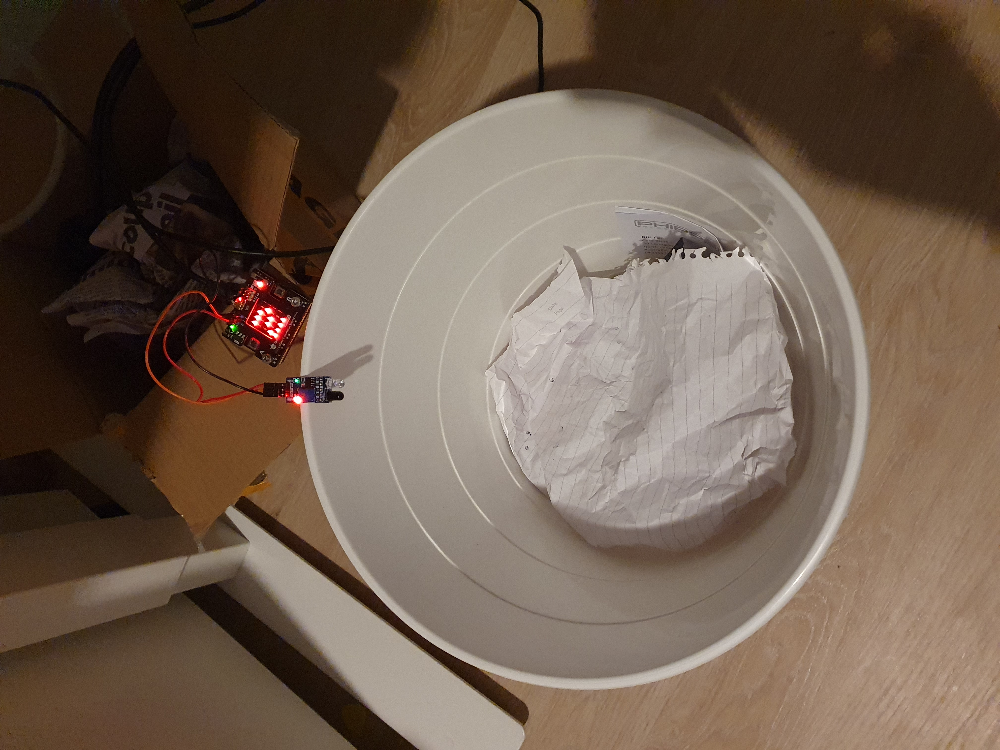

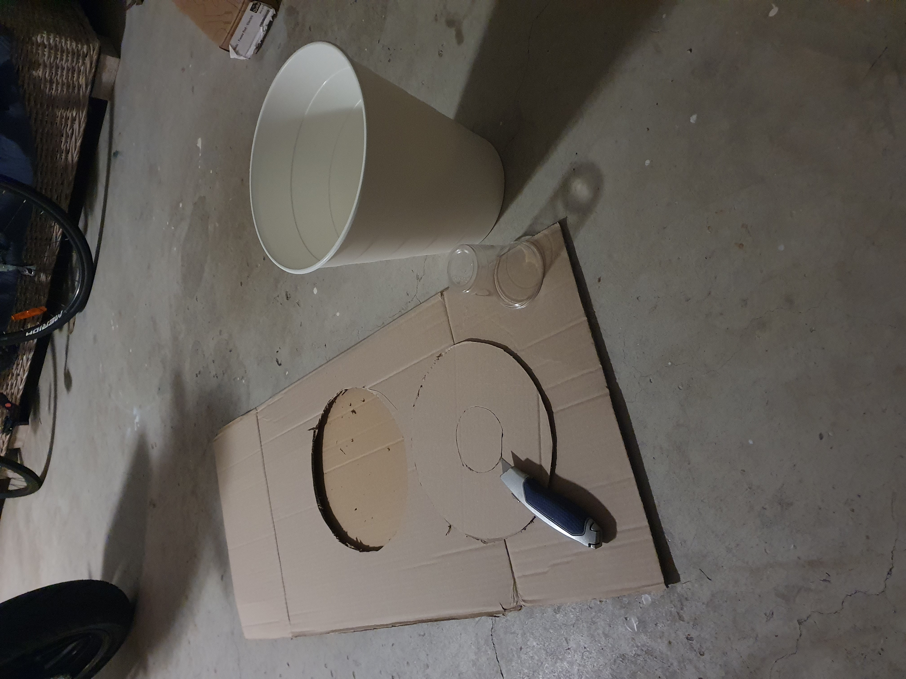

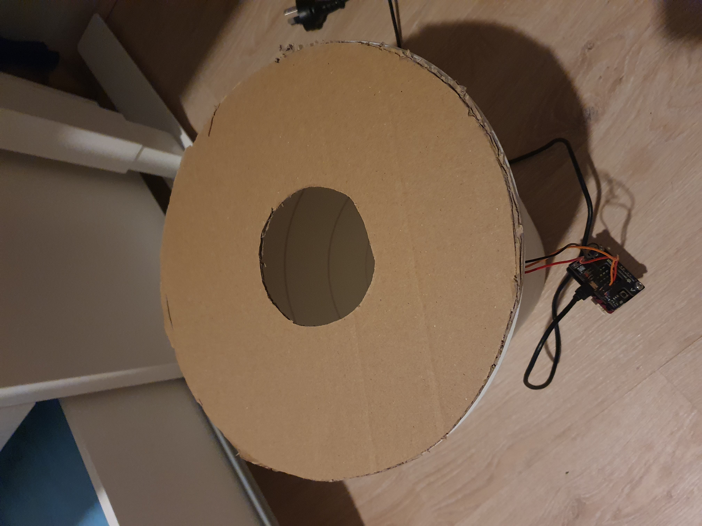

The hole of the bin was too big for the sensor to pick up the paper ball, so I had to create a smaller hole.

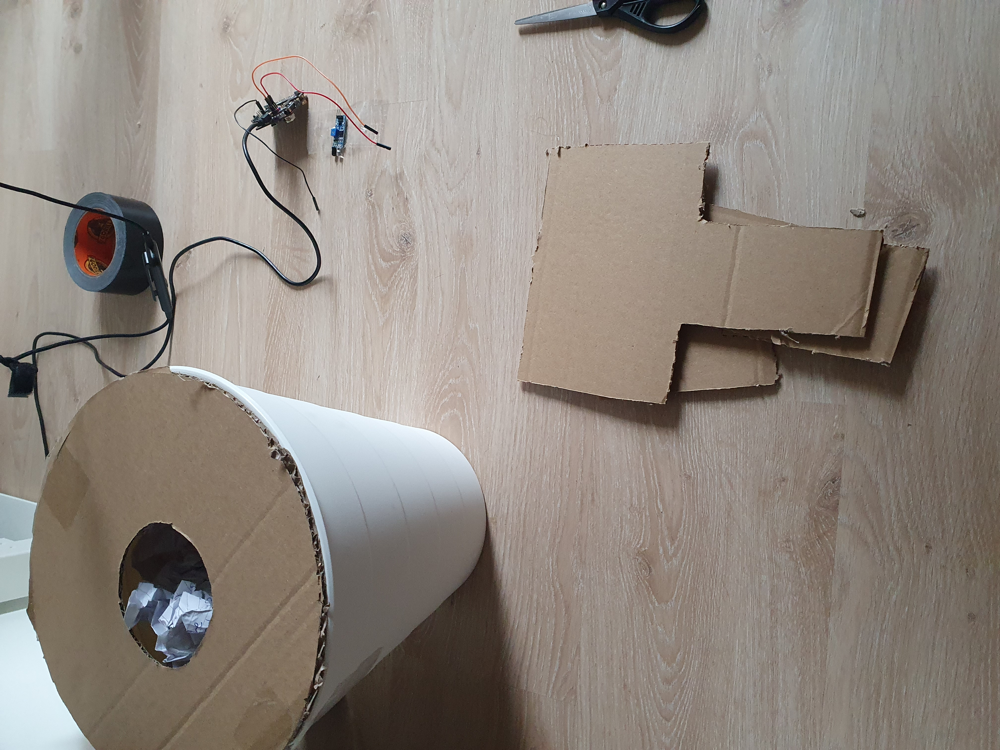

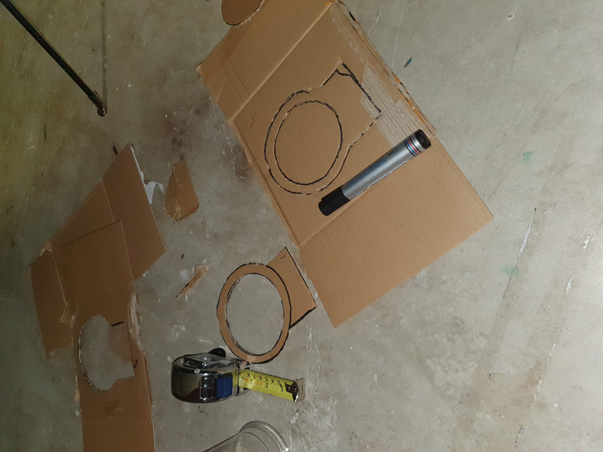

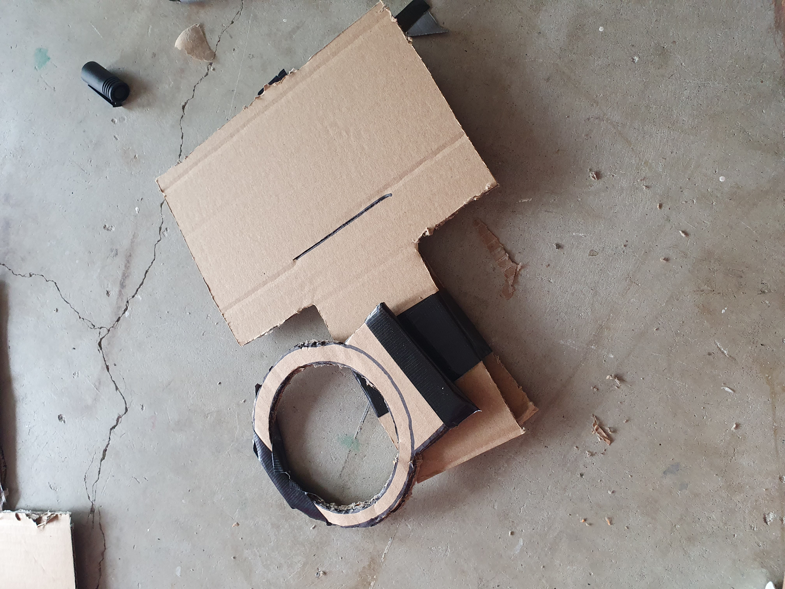

Creating the actual hoop.

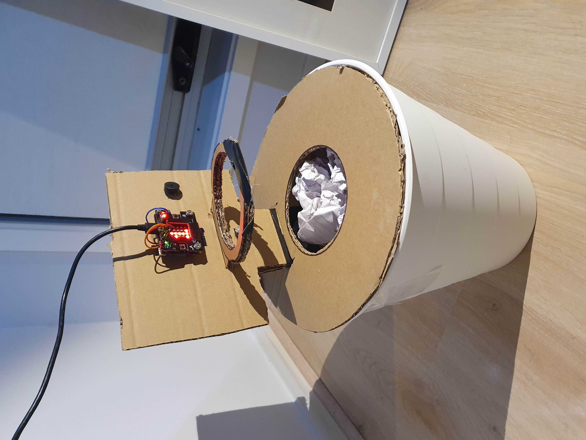

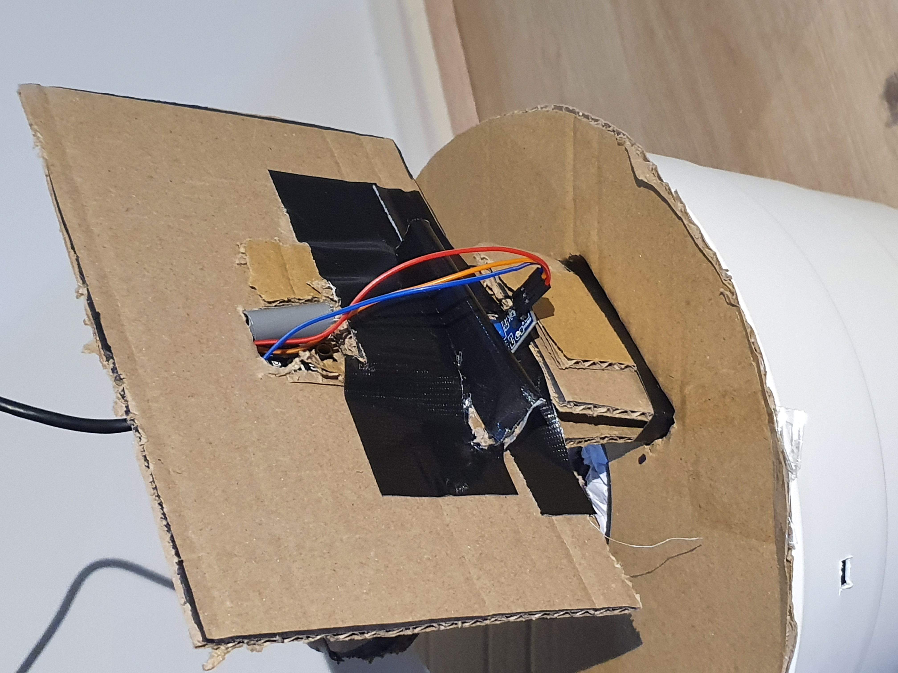

Putting everything together.

## Final code ##

<!--- Include here screenshots of the final code you used in the project if it is done with block coding. If you have used javascript, micropython, C, or other code, include it as text formatted as code using a series of three backticks ` before and after the code block. See https://guides.github.com/features/mastering-markdown/ for more information about that formatting. --->

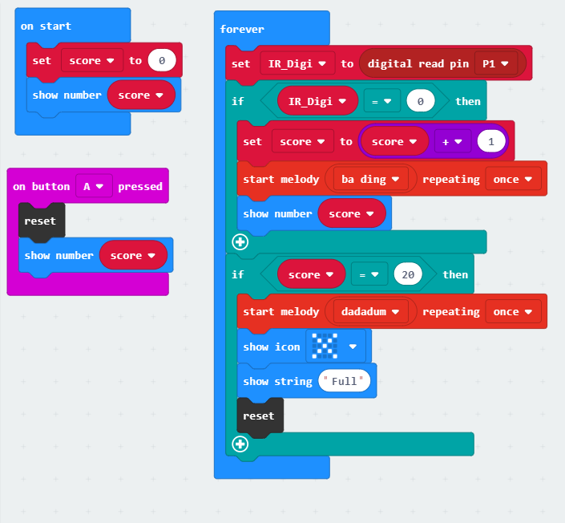

## Design process discussion ##
<!--- Discuss your process used in this project, particularly with reference to aspects of the Double Diamond design methodology or other relevant design process. --->

I first had to decide on what I was going to create. I made this decision by listing my interest and then focusing on one. This interest was basketball. I then I had to define on a specific idea, that is when I came up with the mini hoop game. This wasn't enough so I had to develop it into my own idea which was the bin hoop.

## Reflection ##

I felt the most successful part of my project was using the IR sensor. It world exactly how I wanted it to and was very easy to get it working. 

I felt like my fabrication could of done with some improving. It still looked like a prototype and not a final product.

I found the information about sensors very useful. It gave me a good understanding on how it can be used.  It was also my motivation behind it.

I feel like the part were the bin tells you when it is full is quite different to many projects I've seen. It allows project to interact with the user. The idea of incorporating a game with throwing rubbish in the bin I find is also very different.

## Reflection ##

<!--- Describe the parts of your project you felt were most successful and the parts that could have done with improvement, whether in terms of outcome, process, or understanding.

I felt the most successful part of my project was using the IR sensor. It world exactly how I wanted it to and was very easy to get it working. 

I felt like my fabrication could of done with some improving. It still looked like a prototype and not a final product.

What techniques, approaches, skills, or information did you find useful from other sources (such as the related projects you identified earlier)?

I found the information about sensors very useful. It gave me a good understanding on how it can be used.  It was also my motivation behind it.

What parts of your project do you feel are novel? This is IMPORTANT to help justify a key component of the assessment rubric.

I feel like the part were the bin tells you when it is full is quite different to many projects I've seen. It allows project to interact with the user. The idea of incorporating a game with throwing rubbish in the bin I find is also very different.

What might be an interesting extension of this project? In what other contexts might ths project be used? --->
